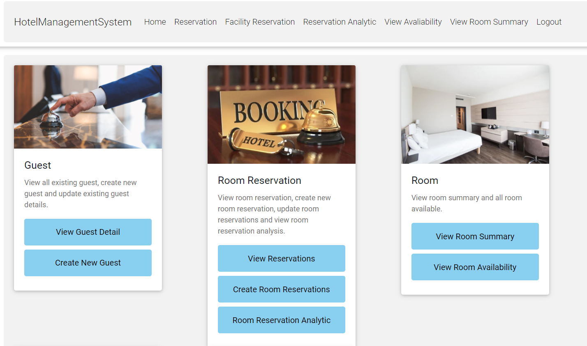

# Hotel Management System: Module 1 - Reservation <!-- omit in toc -->

## Table of Contents <!-- omit in toc -->
* [Reservation](#reservation)
* [Getting Started](#getting-started)
  * [Running the Application](#running-the-application)
* [Collaborators](#collaborators)

## Reservation

This project is done during ICT2106 Software Design, in collaboration with 15 students from 3 different teams. This project allowed us to apply software design skills that we learn during the module in this project. The project is a Hotel Management System that consists of 3 modules and 9 teams. We, Module 1, are deployed to take charge of the designing and implementation of the Reservation side for the Hotel. 

The overall features are:

<ins>Team 4</ins>
  1. Reservation Analytics (All Staff Members to View Only) 
  2. Guest Hotel Reservation Information (View) 
  3. Creation of Room Reservation
  4. Managing Room Reservations (Update and Delete) 
  5. Search/Filter Guest Room Reservation 
  6. Promo Code (View and Create)

<ins>Team 6</ins>
  1. View Availability
  2. Room Summary
  3. Update/Delete Room Types
  4. Create Room Types
  5. Normal Authentication + Pin

<ins>Team 9</ins>
  1. Management/booking of facilities for guests
  2. Booking of transportation for guests
  3. Search/Viewing of guest profile
  4. Updating/Delete Guest Profile
  5. Create Guest Profile

## Getting Started

### Running the Application

1. Download [Visual Studio Community](https://visualstudio.microsoft.com/vs/community/)

2. After cloning/downloading the repository, and open in Visual Studio Community.

3. Open up NuGet Package Management

4. Ensure the following Packages are installed:

5. Open up Package Manager Console under tools (Follow the picture):  

6. Once Package Manager Console is opened, Type in the following command to create the migration and local database:

           Add-Migration -context AppDbContext <name>

           Add-Migration -context Mod2Context <name>

           Update-Database -context AppDbContext

           Update-Database -context Mod2Context
             
7. Congratulations! You can now run the project! :rocket: :rocket:

8. To have access to the features and functions of all the team, please use following are the username and password seeded inside the database:

        Username: user

        Password: pass1

## Collaborators ##
**Module 1 - Reservation**

**Team 4** 
1. **Darrell Er (Team Lead)** | [@derjr96](https://github.com/derjr96)
1. **Wong Kin Seong** | [@puglord96](https://github.com/puglord96)
1. **Er Jayce** | [@JayceEr18](https://github.com/JayceEr18)
1. **Reynard Lim** | [@l2eynard](https://github.com/l2eynard) 
1. **Kang Chang Long** | [@Kchanglong](https://github.com/Kchanglong)

**Team 6**
1. **Tan Yi Hao (Team Lead)** | [@tanyihao](https://github.com/tanyihao)
1. **Yvette** | [@yvetteas](https://github.com/yvetteas)
1. **Wilson Neo** | [@Elslin](https://github.com/Elslin)
1. **Clement Ang** | [@dawnslawter](https://github.com/dawnslawter) 
1. **Loh Wan Loong** | [@WanLoong](https://github.com/WanLoong)

**Team 9**
1. **John Leong (Team Lead)** | [@JohnLeong](https://github.com/JohnLeong)
1. **Ong Zhen Sen** | [@bryanong95](https://github.com/bryanong95)
1. **Wong Zen Kit** | [@nicholaswzk](https://github.com/nicholaswzk)
1. **Alferd Ng** | [@FredoNg](https://github.com/FredoNg) 
1. **Joel Yeo** | [@TheDarkMew](https://github.com/TheDarkMew)
